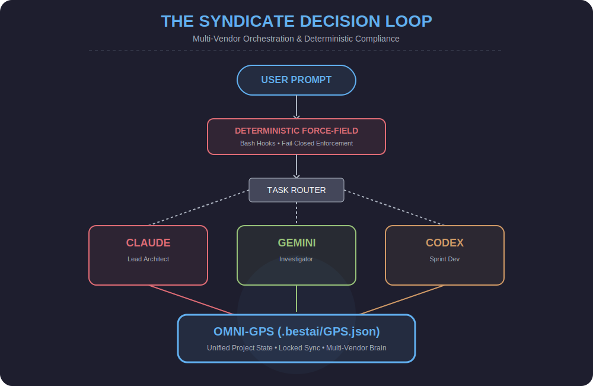
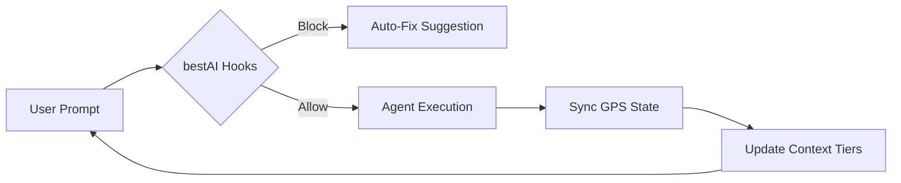

<div align="center">
  
  <h1>bestAI v14.0</h1>
  <p><strong>The Enterprise Fortress for Autonomous Agent Governance.</strong></p>

  [](https://www.npmjs.com/package/@radekzm/bestai)
  []()
  [](https://github.com/radekzm/bestAI)

  <p>
    <a href="#quick-start">Quick Start</a> •
    <a href="#core-mechanisms">Mechanisms</a> •
    <a href="#hook-reference">Hooks</a> •
    <a href="#toolbelt">Toolbelt</a> •
    <a href="#research">Research</a>
  </p>
</div>

---

## What is bestAI?

AI agents ignore advisory rules **94% of the time** in production. bestAI fixes this with **deterministic enforcement hooks** — scripts that intercept tool calls and block violations with `exit 2`. No amount of prompt engineering can bypass a hook.

---

## How It Works



---

## Core Mechanisms

### 1. Deterministic Force-Field (Fail-Closed Hooks)
Every file write or shell command is intercepted. If an agent tries to edit a frozen file, the hook returns `exit 2` — action blocked.

### 2. 5-Tier Context OS
Bypasses token limits by segmenting memory into tiers: T0 (HOT/GPS) to T4 (FROZEN/Config).

### 3. Omni-Vendor Swarm (v14.0)
Deploy a **Syndicate** of agents. Claude for architecture, Gemini for 2M context research, and Codex for tests. Shared project brain via `.bestai/GPS.json`.

---

<a name="research"></a>
## 🔬 Evidence-Based Research

bestAI is developed through rigorous testing in high-stakes environments. Explore our research papers:

- **[Autonomous Persistence (OpenClaw)](docs/RESEARCH-OPENCLAW.md)**: How bestAI enables infinite memory in autonomous loops.
- **[Human-AI Syndicate (Teams)](docs/RESEARCH-TEAM-NEXUS.md)**: A study on coordinating Seniors, Juniors, and AI Swarms in complex IT projects.

---

## ⚡ Quick Start

```bash
# Install globally
npm install -g @radekzm/bestai

# Initialize in your project
bestai init .
```

---

## 🛠️ Toolbelt

| Tool | Command | Description |
|------|---------|-------------|
| `setup.sh` | `bestai init` | Install hooks, templates, blueprints into a project |
| `cockpit.sh` | `bestai cockpit` | Unified live view: limits, knowledge, tasks, routing |
| `swarm-dispatch.sh` | `bestai swarm` | Multi-vendor task dispatch via GPS roles |
| `agent-sandbox.sh` | `bestai sandbox` | Run agent commands in Docker containers |
| `permit.sh` | `bestai permit` | Temporary bypass for frozen files |
| `compliance.sh` | `bestai compliance` | Compliance report from JSONL event log |

---

<div align="center">
  <p>License: MIT | radekzm & the Syndicate Swarm</p>
</div>
