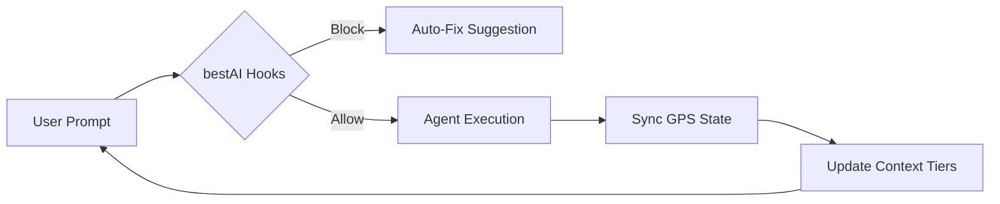

<div align="center">

  <h1>bestAI</h1>

  <p><strong>Evidence-based enforcement hooks and context management for AI coding agents.</strong></p>

  [](https://www.npmjs.com/package/@radekzm/bestai)
  []()
  [](https://github.com/radekzm/bestAI)

  <p>
    <a href="#quick-start">Quick Start</a> •
    <a href="#core-mechanisms">Mechanisms</a> •
    <a href="#hook-reference">Hooks</a> •
    <a href="#toolbelt">Toolbelt</a> •
    <a href="#maturity-matrix">Maturity</a>
  </p>
</div>

---

## What is bestAI?

AI agents ignore CLAUDE.md rules **94% of the time** in production. bestAI fixes this with **deterministic enforcement hooks** — Bash scripts that intercept tool calls and block violations with `exit 2`. No amount of prompt engineering can bypass a hook.

Built on evidence from the Nuconic case study: 234 sessions, 16,761 tool calls, 29 days of production data.

---

## Quick Start

```bash
# Install globally
npm install -g @radekzm/bestai

# Initialize in your project
cd your-project
bestai init .

# Verify installation
bestai doctor
```

Or without global install:
```bash
npx @radekzm/bestai@latest init /path/to/your/project
npx @radekzm/bestai@latest doctor /path/to/your/project
```

---

## How It Works



```
CLAUDE.md = guidance   (advisory — 6% compliance in production)
Hooks     = enforcement (deterministic — exit 2 blocks the action)
```

Critical rules go in hooks. Style preferences stay in CLAUDE.md.

---

## Core Mechanisms

### 1. Deterministic Force-Field (Fail-Closed Hooks)

Every file write or shell command is intercepted. If an agent tries to edit a frozen file, the hook returns `exit 2` — action blocked. Edit/Write hooks are **deterministic** (exact path match, cannot be bypassed). Bash hooks are **best-effort** (~95% enforcement via pattern matching).

### 2. 5-Tier Context OS

Bypasses token limits by segmenting memory into tiers:
- **T0** — Hot context (GPS, active task)
- **T1** — Session state (facts, proofs, blockers)
- **T2** — Memory (weighted entries with generational GC)
- **T3** — Summaries (hierarchical, built offline)
- **T4** — Frozen config (templates, rules)

### 3. Circuit Breaker

Two-phase pattern from distributed systems. `circuit-breaker.sh` (PostToolUse) tracks consecutive failures. After N failures → OPEN. `circuit-breaker-gate.sh` (PreToolUse) blocks commands while circuit is open. Supports HALF-OPEN auto-transition after cooldown.

### 4. Smart Context

Two implementations (mutually exclusive):
- **v1** (`preprocess-prompt.sh`) — keyword/trigram matching. Fast (~200ms). No API calls.
- **v2** (`smart-preprocess-v2.sh`) — LLM-scored injection via Haiku. Slower (~500ms), more accurate for ambiguous queries.

### 5. Session Persistence

At session end: `sync-state.sh` persists TOP-10 FACTS, TOP-5 PROOFS, TOP-3 BLOCKERS, LAST SESSION DELTA. At session start: `rehydrate.sh` restores state — zero file globs, paths from memory.

### 6. Memory GC

`memory-compiler.sh` implements generational garbage collection. Entries scored by `relevance × recency × usage_count`. Three generations: hot → warm → cold → purged.

---

## Hook Reference

All hooks live in `hooks/` and are declared in `hooks/manifest.json` with priority, latency budget, and dependency graph.

### PreToolUse

| Hook | Matcher | Description |
|------|---------|-------------|
| `check-frozen.sh` | Edit, Write, Bash | Blocks edits to frozen files. Resolves symlinks. |
| `secret-guard.sh` | Bash, Write, Edit | Blocks secrets, `.env` access, credential operations. |
| `check-user-tags.sh` | Edit, Write | Prevents removal of `[USER]` tags. |
| `confidence-gate.sh` | Bash | Blocks low-confidence destructive commands. |
| `backup-enforcement.sh` | Bash | Requires backup manifest before deploy/migrate. |
| `circuit-breaker-gate.sh` | Bash | Blocks commands when circuit breaker is OPEN. |
| `wal-logger.sh` | Bash, Write, Edit | Write-ahead log for destructive operations. |

### PostToolUse

| Hook | Matcher | Description |
|------|---------|-------------|
| `circuit-breaker.sh` | Bash | Tracks error patterns, opens breaker after N failures. |
| `ghost-tracker.sh` | Read, Grep, Glob | Tracks file reads for Smart Context scoring. |

### UserPromptSubmit

| Hook | Matcher | Description |
|------|---------|-------------|
| `preprocess-prompt.sh` | — | Smart Context v1 — keyword/trigram injection. |
| `smart-preprocess-v2.sh` | — | Smart Context v2 — LLM-scored injection. |

### SessionStart / Stop

| Hook | Event | Description |
|------|-------|-------------|
| `rehydrate.sh` | SessionStart | Restores session state from delta. |
| `memory-compiler.sh` | Stop | Generational GC for memory entries. |
| `sync-state.sh` | Stop | Persists session state delta. |
| `sync-gps.sh` | Stop | Updates Global Project State. |
| `observer.sh` | Stop | Meta-observations about memory drift. |

---

## Toolbelt

| Tool | Command | Description |
|------|---------|-------------|
| `setup.sh` | `bestai init` | Install hooks, templates, blueprints into a project |
| `doctor.sh` | `bestai doctor` | Validate installation, check versions, verify hooks |
| `stats.sh` | `bestai stats` | Hook latency dashboard (avg/max/count per hook) |
| `cockpit.sh` | `bestai cockpit` | Unified live view: limits, knowledge, tasks, routing |
| `compliance.sh` | `bestai compliance` | Compliance report from JSONL event log |
| `hook-lint.sh` | `bestai lint` | Validate manifest, check dependencies/conflicts |
| `task-router.sh` | `bestai route` | Adaptive vendor/depth routing recommendation |
| `task-memory-binding.sh` | `bestai bind-context` | Pull binding context from project history |
| `validate-shared-context.sh` | `bestai validate-context` | Validate multi-vendor handoff contracts |
| `swarm-dispatch.sh` | `bestai swarm` | Multi-vendor task dispatch via GPS roles |
| `swarm-lock.sh` | `bestai swarm-lock` | Mutex locks across AI vendors |
| `agent-sandbox.sh` | `bestai sandbox` | Run agent commands in Docker containers |
| `generate-rules.sh` | `bestai generate-rules` | Export rules to .cursorrules, .windsurfrules, codex.md |
| `permit.sh` | `bestai permit` | Temporary bypass for frozen files |

---

## Evidence

Based on the **Nuconic case study**: 234 sessions, 16,761 tool calls, 29 days of production data.

Key finding: CLAUDE.md-only compliance was **6%**. With deterministic hooks: **100%** for Edit/Write, **~95%** for Bash (pattern matching limitation).

---

## Maturity Matrix

| Component | Maturity | Evidence |
|-----------|----------|---------|
| Frozen file protection | **Stable** | 234 sessions, deterministic for Edit/Write |
| Circuit breaker | **Stable** | Tested, has gate integration |
| Memory GC | **Stable** | Generational scoring validated |
| Session persistence | **Stable** | Rehydrate/sync-state cycle tested |
| Event logging | **Stable** | JSONL format, compliance reporting |
| Smart Context v1 | **Stable** | Keyword matching, production-tested |
| Smart Context v2 | **Stable** | LLM scoring, latency-acceptable |
| Hook composition | **Stable** | Manifest + lint + dependency graph |
| GPS shared state | **Preview** | Implemented, limited multi-agent testing |
| Multi-vendor dispatch | **Preview** | Dispatcher exists, no production data |
| RAG/vector search | **Preview** | Script exists, no production validation |

---

## Learn More

- [QUICKSTART.md](QUICKSTART.md) — 2-minute setup guide
- [AGENTS.md](AGENTS.md) — Full hook reference for AI agents
- [Architecture](docs/architecture.md) — Technical internals
- [Troubleshooting](TROUBLESHOOTING.md) — Problem → solution guide
- [Modules](modules/) — Detailed guidelines (01-core, 02-operations, 03-advanced)

---

<div align="center">
  <p>License: MIT | radekzm</p>
</div>
