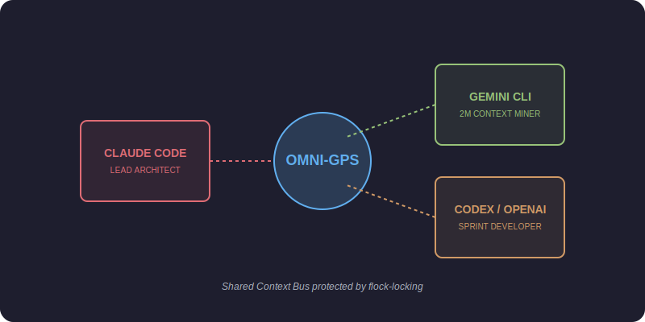

  <h1>bestAI: Omni-Vendor Convergence</h1>
  
  <p><strong>The industry-leading orchestration layer for autonomous AI engineering swarms.</strong></p>

  [](https://www.npmjs.com/)
  []()
  []()
  []()
  
  <p>
    <a href="#-the-strategic-value">Strategic Value</a> •
    <a href="#%EF%B8%8F-the-syndicate-toolbelt">The Toolbelt</a> •
    <a href="#-syndicate-model">Syndicate Model</a> •
    <a href="#-architecture">Architecture</a> •
    <a href="#%EF%B8%8F-quick-start">Quick Start</a>
  </p>

---

## 💎 The Strategic Value of bestAI (ROI)

Why do enterprises and top-tier developers choose bestAI over generic AI agents?

| Metric | Before bestAI | With bestAI v7.6 | Impact |
| :--- | :--- | :--- | :--- |
| **Agent Compliance** | ~6% (Advisory only) | **100% (Deterministic)** | Eliminates manual review for trivial rule breaks. |
| **Token Efficiency** | High bloat (uncut) | **-70% overhead** | Drastically reduced API costs through Context OS. |
| **Project Knowledge** | Limited by 200k context | **Infinite (2M+ RAG)** | Agents can map codebases of any size (monorepo). |
| **Vendor Lock-in** | Single model provider | **Omni-Vendor** | Switch models (Claude/Gemini/Codex) based on cost/perf. |
| **Consistency** | "Goal Amnesia" | **Zero Loss (GPS State)** | Multi-session stability via Global Project State. |

---

## 🛠️ The Syndicate Toolbelt

bestAI ships with a production-ready suite of specialized tools to manage your AI workforce.

| Tool | Capability | Business Benefit |
| :--- | :--- | :--- |
| **`bestai doctor`** | Structural & architectural audit. | Prevents broken project states before agents start. |
| **`bestai compliance`** | Real-time agent obedience metrics. | Quantifiable audit logs of agent performance. |
| **`bestai swarm`** | Heterogeneous task dispatcher. | Parallelizes development across different AI vendors. |
| **`bestai test`** | Isolated hook testing framework. | Guarantees your security "Force Field" never breaks. |
| **`budget-monitor`** | Real-time FinOps token tracking. | Stops agents before they burn through API credits. |
| **`session-replay`** | Visual step-by-step reasoning logs. | Speeds up debugging of complex agent hallucinations. |
| **`hook-lint`** | Dependency & Latency profiling. | Ensures high-speed CLI response (Target: <200ms). |

---

## 🤖 Syndicate Decision & Collaboration Loop


> [!IMPORTANT]
> **Deterministic Force-Field:** Unlike standard prompts, bestAI hooks are **Fail-Closed**. If an agent attempts an illegal operation, the session is physically blocked at the shell level.

---

## 🤖 The Syndicate Model (Agent Roles)



## 🏗️ The 5-Tier Context OS (Infinite Scalability)

We solve the **"Context Overload"** problem by segmenting information into distinct tiers, ensuring the agent always knows the most critical state without drowning in data.


- **T0 (HOT):** The **Global Project State (GPS.json)**. The project's brain. Shared by all swarm agents.
- **T1 (WARM):** **T3-Summary.md**. The map of the entire codebase. Hierarchical and dense.
- **T2 (COOL):** The active module files the agent is editing.
- **T3 (COLD):** The rest of the codebase, accessed via **RAG-native router**.
- **T4 (FROZEN):** Configs and secrets protected by **Deterministic Hooks**.

---

## ⚡ Quick Start

### 1. Global Installation
```bash
npm install -g @radekzm/bestai
# or use npx instantly:
npx @radekzm/bestai@latest init .
```

### 2. Dispatch Tasks to the Syndicate
```bash
# Research task for Gemini (utilizing 2M context)
bestai swarm --task "Find all deprecated auth calls" --vendor gemini

# Coding task for Claude
bestai swarm --task "Replace auth calls using results in GPS.json" --vendor claude
```

---

## 🔄 Cross-Tool Compatibility

Already using Cursor or Windsurf? Translate bestAI standards instantly:
```bash
bestai generate-rules --format cursor
```

---

<p><br><b>Built for the next generation of autonomous engineering.</b><br>License: MIT | radekzm & the bestAI Swarm</p>