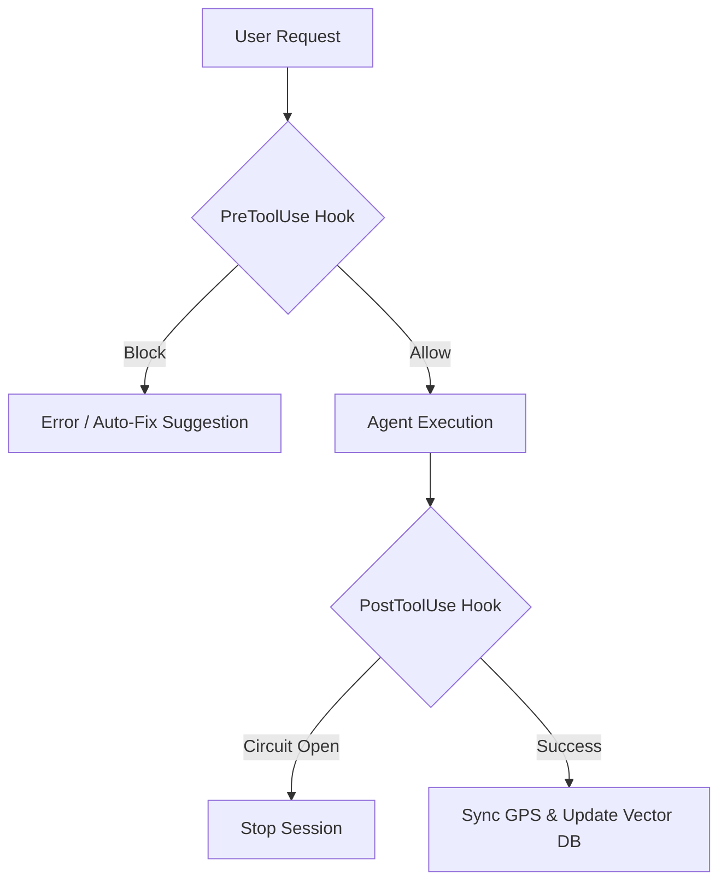

<div align="center">
  

  <h1>bestAI v6.0</h1>
  
  <p><strong>The Enterprise-Grade Architecture & Deterministic Force Field for AI Coding Agents.</strong></p>

  [](https://www.npmjs.com/)
  [](LICENSE)
  []()
  []()
  []()
  
  <p>
    <a href="#-why-bestai">Why bestAI?</a> •
    <a href="#-core-features">Core Features</a> •
    <a href="#%EF%B8%8F-quick-start">Quick Start</a> •
    <a href="#-the-architecture">Architecture</a> •
    <a href="#-migration--docs">Documentation</a>
  </p>
</div>

---

## 🛑 Why bestAI?

AI coding agents (like Claude Code, Cursor, or Windsurf) are incredibly powerful, but in production environments, they suffer from **goal amnesia**, **context overflow**, and **hallucination loops**.

> **The Hard Truth:** AI agents follow generic `CLAUDE.md` rules only **6% of the time** during complex sessions (Nuconic Case Study: 234 sessions over 29 days).

**bestAI v6.0** solves this. It replaces advisory guidelines with a **Deterministic Force Field (Bash Hooks)**, wraps the project in a **Global Project State (GPS)** for multi-agent coordination, and scales infinitely using a **RAG-Native Context OS**.

---

## ✨ Core Features (v6.0)

<details open>
<summary><b>🛡️ Deterministic Hook Enforcement (Fail-Closed)</b></summary>
<br>
Agents cannot bypass security rules. PreToolUse and PostToolUse Bash hooks physically block the agent (`Exit 2`) if it tries to edit frozen files (`check-frozen.sh`), skips backups (`backup-enforcement.sh`), or loops endlessly (`circuit-breaker-gate.sh`).
</details>

<details open>
<summary><b>🤖 Distributed Agent Swarms (GPS)</b></summary>
<br>
Native support for spawning parallel agents (e.g., Frontend Agent, Backend Agent, Devil's Advocate Reviewer). They synchronize via the `.bestai/GPS.json` Global Project State, ensuring zero conflicts.
</details>

<details open>
<summary><b>🧠 RAG-Native Semantic Memory & "Invisible Limit"</b></summary>
<br>
Eliminates context window bloat. T3 (Cold Storage) files are dynamically summarized. Vector DB integration (`sqlite-vec`) ensures long-term memory retrieval without exhausting token budgets.
</details>

<details open>
<summary><b>📊 Enterprise Observability & CI Testing</b></summary>
<br>
Includes `tools/budget-monitor.sh` for FinOps, `tools/session-replay.py` for debugging agent thoughts in real-time, and a comprehensive BATS-style testing framework for CI/CD pipelines.
</details>

---

## ⚡ Quick Start

With v6.0, bestAI is now globally distributed via NPM.

### 1. Install Globally
```bash
npm install -g bestai
# or use npx without installing:
npx bestai setup .
```

### 2. Initialize in your Project
Navigate to your repository and run the setup wizard.
```bash
cd my-project
bestai setup
```
*(The wizard will idempotently merge rules, set up `.claude/settings.json`, and offer v6.0 Scaffolding Blueprints).*

### 3. Check System Health
Validate your v6.0 architecture (Worktrees, RAG Indexes, Hook Latency) instantly:
```bash
bestai doctor --strict
```


---

## 🏗️ The Architecture (The 3 Pillars)

The bestAI knowledge base has been drastically consolidated to save token context. 

| Pillar | Focus | Link |
|--------|-------|------|
| **01: CORE** | Context OS, Enforcements, GPS | [Read 01-core](modules/01-core.md) |
| **02: OPERATIONS** | Checklists, Caching, Session Mgmt | [Read 02-operations](modules/02-operations.md) |
| **03: ADVANCED** | Vector DB, Agent Teams, RAG | [Read 03-advanced](modules/03-advanced.md) |

### Context OS Flow

*(Rendered using Mermaid.js)*

---

## 🔄 Cross-Tool Compatibility

Not using Claude Code? No problem. bestAI v6.0 ships with a translator.
```bash
bash tools/generate-rules.sh . --format cursor
```
This automatically builds robust `.cursorrules` or `.windsurfrules` files based on your bestAI configurations.

---

## 📚 Migration & Docs

Upgrading from an older AI setup or a bloated `CLAUDE.md`? 
Read our **[v6.0 Migration Guide](docs/migration-guide.md)** for a zero-downtime transition path.

---

## 🤝 Contributing

We welcome pull requests! Please ensure you run the testing framework before submitting:
```bash
bestai test
```
All new hooks must pass the latency budget (`<200ms`) validated by `tools/hook-lint.sh`.

<div align="center">
  <p><br>Built for the next generation of autonomous engineering.<br><b>License: MIT</b></p>
</div>