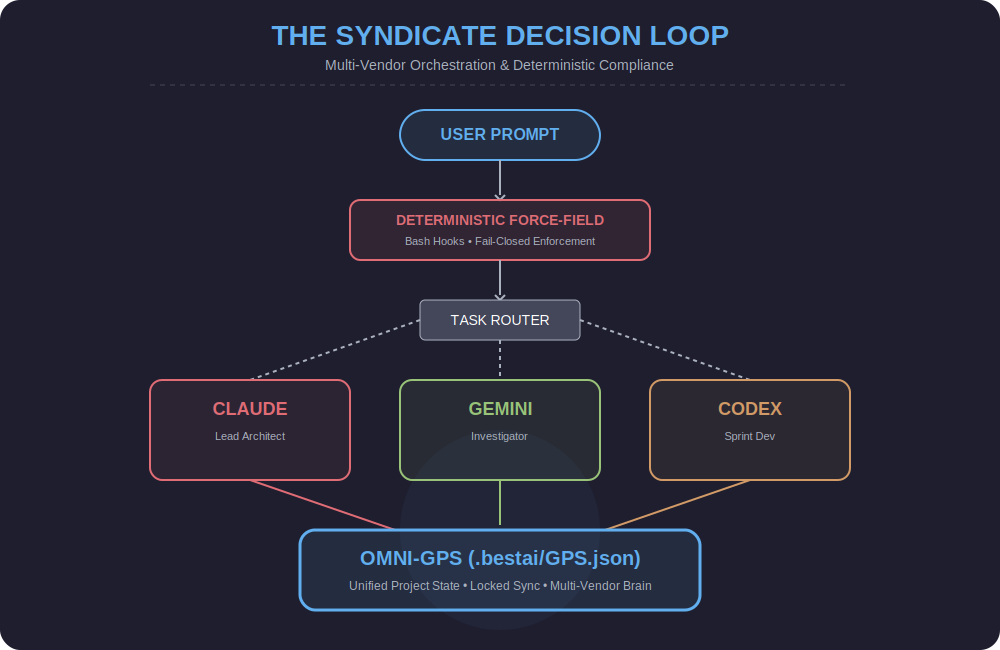
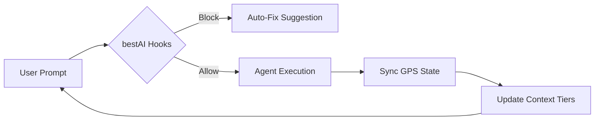

<div align="center">
  
  <h1>bestAI v1.5 (Stable)</h1>
  <p><strong>Deterministic Governance &amp; Multi-Agent Orchestration for AI Swarms.</strong></p>

  [](https://www.npmjs.com/package/@radekzm/bestai)
  [](https://github.com/radekzm/bestAI/actions)
  [](LICENSE)

  <p>
    <a href="#quick-start">Quick Start</a> •
    <a href="#core-mechanisms">Mechanisms</a> •
    <a href="#toolbelt">Toolbelt</a> •
    <a href="#orchestrator">Orchestrator</a> •
    <a href="#research">Research</a>
  </p>
</div>

---

## What is bestAI?

AI agents ignore advisory rules **94% of the time** in production. bestAI fixes this with **deterministic enforcement hooks** — scripts that intercept tool calls and block violations with `exit 2`. No amount of prompt engineering can bypass a hook.

---

## How It Works


```mermaid
graph LR
    User[User Prompt] --> Hook{bestAI Hooks}
    Hook -- Block --> Fix[Auto-Fix Suggestion]
    Hook -- Allow --> Exec[Agent Execution]
    Exec --> GPS[Sync GPS State]
    GPS --> Context[Update Context Tiers]
    Context --> User
```

---

## Core Mechanisms

### 1. Deterministic Force-Field (Fail-Closed Hooks)
Every file write or shell command is intercepted. If an agent tries to edit a frozen file, the hook returns `exit 2` — action blocked. Surgical Patching Policy prevents whole-file rewrites on files >100 lines.

### 2. 5-Tier Context OS
Bypasses token limits by segmenting memory into tiers: T0 (HOT/GPS) to T4 (FROZEN/Config). Smart context preprocessing scores memory files for relevance.

### 3. Omni-Vendor Swarm
Deploy a **Syndicate** of agents. Claude for architecture, Gemini for 2M context research, and Codex for tests. Shared project brain via `.bestai/GPS.json`.

### 4. Self-Healing Knowledge Base
Automatically analyzes event logs for recurring violations and updates `memory/pitfalls.md` — the system learns from its own mistakes.

---

<a name="quick-start"></a>

## Quick Start

```bash
# Install globally
npm install -g @radekzm/bestai

# Initialize in your project
bestai init .

# Show all commands
bestai --help

# Run diagnostics
bestai doctor
```

---

<a name="toolbelt"></a>

## Toolbelt

### Core Commands

| Command | Tool | Description |
|---------|------|-------------|
| `bestai init` | `setup.sh` | Install hooks, templates, blueprints into a project |
| `bestai doctor` | `doctor.sh` | Health check and diagnostics |
| `bestai cockpit` | `cockpit.sh` | Live dashboard: limits, knowledge, tasks, routing |
| `bestai compliance` | `compliance.sh` | Compliance report from JSONL event log |
| `bestai stats` | `stats.sh` | Project statistics |

### Agent & Swarm Commands

| Command | Tool | Description |
|---------|------|-------------|
| `bestai swarm` | `swarm-dispatch.sh` | Multi-vendor task dispatch via GPS roles |
| `bestai swarm-lock` | `swarm-lock.sh` | Mutex lock/unlock for multi-agent coordination |
| `bestai plan` | `plan.sh` | Architect Mode — high-level planning, zero code |
| `bestai sandbox` | `agent-sandbox.sh` | Run agent commands in Docker containers |
| `bestai permit` | `permit.sh` | Temporary bypass for frozen files |

### Advanced Tools

| Command | Tool | Description |
|---------|------|-------------|
| `bestai generate-rules` | `generate-rules.sh` | Generate CLAUDE.md rules from templates |
| `bestai shared-context-merge` | `shared-context-merge.sh` | Merge shared context files from multiple agents |
| `bestai route` | `task-router.sh` | Smart task routing with policy + history |
| `bestai bind-context` | `task-memory-binding.sh` | Bind memory tiers to task context |
| `bestai self-heal` | `self-heal.py` | Auto-update pitfalls from violation patterns |
| `bestai mcp` | `mcp-server.py` | Model Context Protocol server bridge |
| `bestai lint` | `hook-lint.sh` | Lint hooks for correctness |

---

<a name="orchestrator"></a>

## Orchestrator (Experimental)

The orchestrator provides a daemon + TUI console for real-time multi-agent management:

- **Daemon**: Background process managing task queue and agent lifecycle
- **TUI Console**: Interactive terminal UI with task list, budget panel, agent status, and bidirectional conversation view
- **SQLite WAL**: Concurrent read/write for TUI-daemon communication

```bash
# Build orchestrator
cd orchestrator && npm ci && npm run build && cd ..

# Start daemon + console
bestai orchestrate    # daemon
bestai console        # TUI
```

Orchestrator commands: `orchestrate`, `task`, `agent`, `events`, `console`.

---

<a name="research"></a>

## Research

bestAI is developed through rigorous testing in high-stakes environments:

- **[Autonomous Persistence (OpenClaw)](docs/RESEARCH-OPENCLAW.md)**: How bestAI enables infinite memory in autonomous loops.
- **[Human-AI Syndicate (Teams)](docs/RESEARCH-TEAM-NEXUS.md)**: Coordinating Seniors, Juniors, and AI Swarms in complex IT projects.

## Quality

- [QUALITY-10-10 Playbook](docs/QUALITY-10-10.md)

---

<div align="center">
  <p>License: MIT | radekzm &amp; the Syndicate Swarm</p>
</div>
