<div align="center">
  

  <h1>bestAI: Omni-Vendor Convergence</h1>
  
  <p><strong>The industry-leading orchestration layer for autonomous AI engineering swarms.</strong></p>

  [](https://www.npmjs.com/)
  []()
  []()
  []()
  [](https://github.com/radekzm/bestAI)
  
  <p>
    <a href="#-quick-start">Quick Start</a> •
    <a href="#-tutorial-your-first-swarm">Tutorial</a> •
    <a href="#-v100-the-living-swarm">v10.0 Living Swarm</a> •
    <a href="#-core-mechanisms">Mechanisms</a> •
    <a href="#-syndicate-toolbelt">Toolbelt</a>
  </p>
</div>

---

## 🔄 How bestAI Works (The Workflow)

```mermaid
graph LR
    User[User Prompt] --> Hook{🛡️ bestAI Hooks}
    Hook -- Block --> Fix[💡 Auto-Fix Suggestion]
    Hook -- Allow --> Exec[🤖 Agent Execution]
    Exec --> GPS[🛰️ Sync GPS State]
    GPS --> Context[🧠 Update Context Tiers]
    Context --> User
```



---

## 📜 The AI Agent Contract (v10.1)

bestAI projects are now self-documenting for incoming agents. The `.bestai/CONTRACT.json` file provides a machine-readable definition of:
- **Capabilities:** What enforcement and orchestration modes are active.
- **Toolbelt:** List of available `bestai` commands and their purpose.
- **Security:** Which files are protected and how bypasses are handled.

Incoming agents (Claude, GPT, etc.) read this contract at boot to align with your project's deterministic standards.

---

## ⚡ v10.0: The Living Swarm (Conductor Mode)

The latest evolution of bestAI introduces the **Syndicate Conductor**. You no longer wait for agents. You interact with a central "Project Brain" that orchestrates specialists in real-time.

### Key v10.0 Mechanisms:
- **Asynchronous Execution:** Sub-agents (Claude, Gemini) work in background threads.
- **Intelligence Filtering:** The Conductor only alerts you for critical milestones or errors.
- **Research Vault (TTL):** Global cache for codebase analysis. Run once, remember forever.
- **Continuous Conversation:** A persistent shell that maintains multiple thought-streams.

🎬 **[Watch the v10.0 Living Swarm Demo](docs/V10-DEMO.md)**

👉 Run it now: `bestai conductor`

---

## 👥 v13.0: The Human-AI Nexus (Team Collaboration)

bestAI v13.0 transforms from an individual tool to a **Team Governance Platform**. It enables Juniors, Seniors, and Managers to collaborate with AI Swarms through a unified project brain.

### Key v13.0 Mechanisms:
- **Nexus Journal:** Every strategic human decision is logged and injected into the AI's T0 context, preventing models from contradicting human intent.
- **Role-Based Governance:** Customize hook intensity based on the user's seniority (e.g., Juniors get stricter Fail-Closed safety).
- **Knowledge Handshake:** Automated onboarding for new team members by parsing the Research Vault and Nexus logs.

**The Nexus Workflow:**


👉 **Run a check-in:** `bestai nexus --user "Name" --role "Lead" --decision "..."`

---

## 🧠 v12.0: The Elastic Brain (Infinite Depth)

bestAI v12.0 eliminates the "flat context" problem. It introduces **Dynamic Context Zoom**, where the granularity of loaded data matches the precision of your task.

### Key v12.0 Mechanisms:
- **Macro/Micro Lens:** The Conductor stays high-level (strategic), while specialists (Sub-agents) are pumped with granular technical details only when a specific "Deep Task" is triggered.
- **Recursive Delegation:** If a task is too complex, the agent spawns its own sub-swarm, preventing context saturation and maintaining 100% precision.
- **Context Pressure Monitor:** Automatically triggers delegation when an agent's memory usage exceeds optimal thresholds.

**The Elastic Workflow:**
```mermaid
graph TD
    User[User Input] --> Conductor{Dyrygent (Macro)}
    Conductor -- Specific Task --> Specialist[Specialist (Micro Context)]
    Specialist -- Too Heavy? --> SubSwarm[Recursive Sub-Swarm]
    SubSwarm -- Results --> Specialist
    Specialist -- Summary --> Conductor
    Conductor -- Strategic Feedback --> User
```

👉 Run it now: `bestai conductor`

---

## ⏳ v11.0: The Time Machine & Autonomous Guardian

We identified the two biggest wastes of time and tokens in AI engineering: starting late on a messy project, and forcing LLMs to read the entire codebase just to figure out what needs testing. **v11.0 fixes both.**

### 1. The Time Machine (Retroactive Onboarding)
[]()

Did you start using AI without bestAI? It's a mess, right? The Time Machine parses your messy, gigabyte-sized `.claude/history.jsonl` (or similar logs) **offline** (saving millions of tokens). It extracts architectural decisions and milestones, instantly generating a perfect `.bestai/GPS.json` and knowledge base.

**The Workflow:**

👉 **Run:** `bestai retro-onboard`

### 2. The Autonomous Guardian (Token-Saving Test Builder)
[]()

Why pay Claude API to scan 50 files just to write empty test stubs? The **Guardian** is an external script that statically analyzes your codebase, cross-references it with `GPS.json` functionalities, and automatically generates missing test boilerplates. You then simply command the agent: *"Fill in the empty tests."* **Token savings: ~80%.**

**The Workflow:**

👉 **Run:** `bestai guardian`

---

## 🌌 bestAI + OpenClaw
**High-Persistence Autonomous Intelligence.**
Using bestAI in OpenClaw unlocks **Total Recall Mode**. Preserve every decision, decision log, and codebase change across weeks of autonomous operation. No pruning, no forgetting.

👉 **[Learn how bestAI powers OpenClaw](docs/OPENCLAW.md)**

---

## 🏗️ bestAI for IT Projects
**Enterprise-Grade Standards for AI Engineering.**
Build robust IT projects with **Deterministic Compliance**. bestAI forces agents to follow security, testing, and architectural rules, reducing technical debt by 90%.

👉 **[Learn how bestAI builds IT Projects](docs/IT-PROJECTS.md)**

---

## 🚀 Quick Start (Zero-to-Hero)

### The One-Command OpenClaw Installer (v9.0+)
Deploy a fully configured, high-persistence multi-agent environment instantly:
```bash
curl -s https://raw.githubusercontent.com/radekzm/bestAI/master/install-openclaw.sh | bash
```

### Manual Global Install
```bash
npm install -g @radekzm/bestai
```

### 2. Initialize bestAI in your Repo
```bash
cd your-project
bestai init .
```
*Select the **"Omni-Vendor"** profile for the full multi-agent experience.*

### 3. Verify Health
```bash
bestai doctor --strict
```

---

## 📖 Tutorial: Your First Swarm (Mini-API)

In this example, we will build a simple FastAPI application using **Gemini** for mapping and **Claude** for implementation.

### Step 1: Initialize the Project State
Define your goal so all agents are aligned.
```bash
# Set the main goal in .bestai/GPS.json
echo '{"project":{"name":"FastAPI-Mini","main_objective":"Build a secure user registration API"}}' > .bestai/GPS.json
```

### Step 2: Gemini Investigates (Research)
Gemini scans your environment and suggests the tech stack.
```bash
bestai swarm --vendor gemini --task "Search for best FastAPI boilerplates and update T3-summary.md"
```

### Step 3: Claude Implements (Coding)
Claude reads the research from GPS and implement the code, protected by hooks.
```bash
bestai swarm --vendor claude --task "Create main.py with a signup endpoint using standard FastAPI patterns"
```

### Step 4: Verify Compliance
Check if the agents followed the rules.
```bash
bestai compliance
```

## 🔐 Agent Authorization & Security

bestAI follows a **Zero-Knowledge** credential policy. Agents never handle raw API keys.

### 1. Credential Delegation
Before starting the swarm, ensure your local CLI tools are authenticated:
- **Claude:** `claude auth login`
- **Gemini:** `export GOOGLE_API_KEY=your_key` (in your shell, not in files)
- **Ollama:** Running locally on `localhost:11434`

### 2. The Secret-Guard Force-Field
All bestAI projects include `hooks/secret-guard.sh`. This hook physically blocks agents from:
- **Reading Secrets:** Attempts to `cat .env` or read SSH keys are blocked.
- **Exfiltration:** Attempts to `curl` local data to external servers are intercepted.
- **Leaking:** If an agent accidentally generates a secret in code, bestAI prevents the file write.

> [!CAUTION]
> Never ask an agent to "Manage my API keys". Always handle authentication manually in your host terminal.

---

## 🔧 Core Mechanisms (Under the Hood)

bestAI is built on five revolutionary engineering pillars:

### 1. Deterministic Force-Field (Fail-Closed Hooks)
Unlike soft prompt-based rules, bestAI uses **Bash Hooks**. Every file write or shell command is intercepted. If an agent tries to edit a `FROZEN` file, the script returns `Exit 2`.

### 2. The 5-Tier Context OS
We bypass token limits by segmenting memory: T0 (Hot/GPS) to T4 (Frozen/Config).

### 3. Omni-GPS (Shared Global State)
A central JSON bus that synchronizes all agents (milestones, blockers, architectural decisions).

### 4. Swarm Mutex (`swarm-lock`)
Specifically for multi-vendor setups. Before any agent starts a heavy task, it places a lock on the target file path.

### 5. Human-in-the-Loop (`bestai permit`)
The ultimate override mechanism. Grant a temporary pass:
`bestai permit package.json --duration 10m`

---

## 💎 The Strategic Value of bestAI (ROI)

| Metric | Before bestAI | With bestAI v10.0 | Impact |
| :--- | :--- | :--- | :--- |
| **Agent Compliance** | ~6% (Advisory only) | **100% (Deterministic)** | Bulletproof safety. |
| **Token Efficiency** | High bloat (uncut) | **-70% overhead** | Low API bills. |
| **Vendor Lock-in** | Single model provider | **Omni-Vendor** | Flexibility (Claude+Gemini+Llama). |

---

## 🛠️ The Syndicate Toolbelt

| Tool | Capability |
| :--- | :--- |
| **`bestai conductor`** | The central AI orchestrator for real-time swarms. |
| **`bestai swarm`** | Dispatches tasks to Claude, Gemini, or Ollama. |
| **`serve-dashboard`** | Visual web interface for compliance and budget. |
| **`bestai sandbox`** | Runs agent commands in isolated Docker containers. |
| **`swarm-lock`** | Manage mutex locks across different AI vendors. |

---

<div align="center">
  <p><br><b>Built for the next generation of autonomous engineering.</b><br>License: MIT | radekzm & the bestAI Swarm</p>
</div>