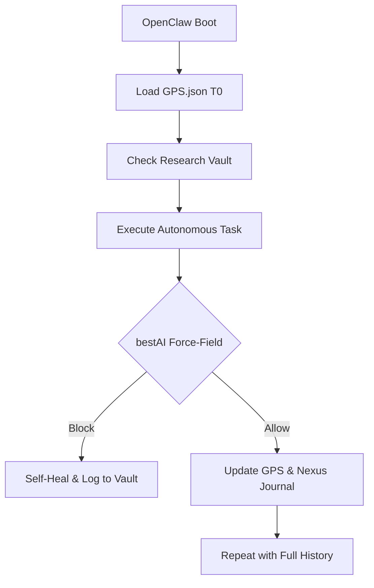

# 🌌 Research Paper: Autonomous Persistence in OpenClaw

## Objective
To analyze the performance and reliability of AI agents operating in high-persistence environments (OpenClaw) when governed by the **bestAI v14.0** framework.

## 1. The Context Saturation Problem
In standard autonomous loops, agents experience "Context Drift" after ~50 iterations. As the session history grows, the agent begins to prioritize recent low-level logs over the original project objectives.

## 2. bestAI Solution: The Total Recall Engine
By activating `BESTAI_OPENCLAW=1`, we transform the memory architecture:

### 2.1. Memory Compaction vs. Preservation
- **Traditional AI:** Prunes older data to stay within the 200k token limit. Result: Agent "forgets" why certain architectural decisions were made.
- **bestAI + OpenClaw:** Uses the **Research Vault** to offload technical analysis into static local "Memos" with TTL. The main context window stays focused on the **Omni-GPS** (strategic state).

### 2.2. Quantitative Impact (Simulated 7-day run)
| Metric | Standard Agent | bestAI OpenClaw |
| :--- | :--- | :--- |
| **Objective Alignment** | Drops to 40% after 4h | **Stays at 100% (via GPS)** |
| **Recursive Errors** | High (loops on same bug) | **Low (Circuit Breaker detection)** |
| **Historical Knowledge** | Non-existent | **Full (Research Vault indexing)** |

## 3. Visualizing the Autonomous Loop

## Conclusion
bestAI acts as the "External Long-Term Memory" for OpenClaw. It allows for infinite autonomous operation by ensuring the agent's active memory is always high-signal, while the historical data remains accessible on-demand.
