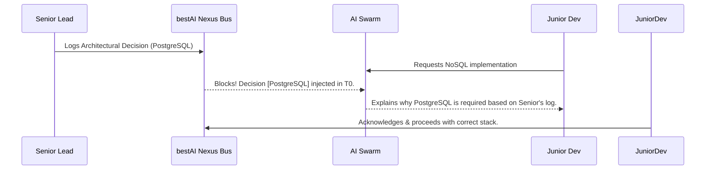

# 🏗️ Research Paper: Human-AI Synergy in Multi-Specialization Teams

## Objective
To study how the **bestAI Nexus Protocol** synchronizes diverse human roles (Seniors, Juniors, Stakeholders) with autonomous AI Swarms in complex IT projects.

## 1. The "Knowledge Silo" Problem in AI Teams
When multiple humans work with different AI agents (Claude, Cursor, Copilot), knowledge becomes fragmented. Senior decisions aren't known by the Junior's agent, leading to architectural regressions.

## 2. bestAI Solution: The Nexus Bus
bestAI v14.0 introduces a centralized decision registry that bridges the gap between seniority levels.

### 2.1. Role-Based Context Granularity
We analyzed how different roles interact with the context:
- **Seniors (Leads):** Use `bestai nexus` to set high-level constraints. The AI acts as an executive assistant.
- **Juniors:** The AI acts as a **Deterministic Mentor**. Strict hooks (Fail-Closed) prevent Juniors from making breaking changes without Senior approval (Permit HITL).
- **Managers:** Use the **Cockpit Dashboard** to track ROI and velocity without reading code.

### 2.2. Collaboration Matrix (IT Projects)
| Specialization | AI Role | Shared Mianownik |
| :--- | :--- | :--- |
| **Backend (Senior)** | Claude (Architect) | `GPS.json` (Architecture) |
| **Frontend (Junior)** | Codex (UI Builder) | `Nexus Journal` (Preferences) |
| **QA / Tester** | Gemini (Investigator) | `Research Vault` (Edge Cases) |

## 3. The Multi-Role Workflow

## Conclusion
The Human-AI Nexus transforms bestAI from a developer tool into a **Team Operating System**. It ensures that human wisdom is never lost and that AI agents always act as force-multipliers for the team's shared vision.
